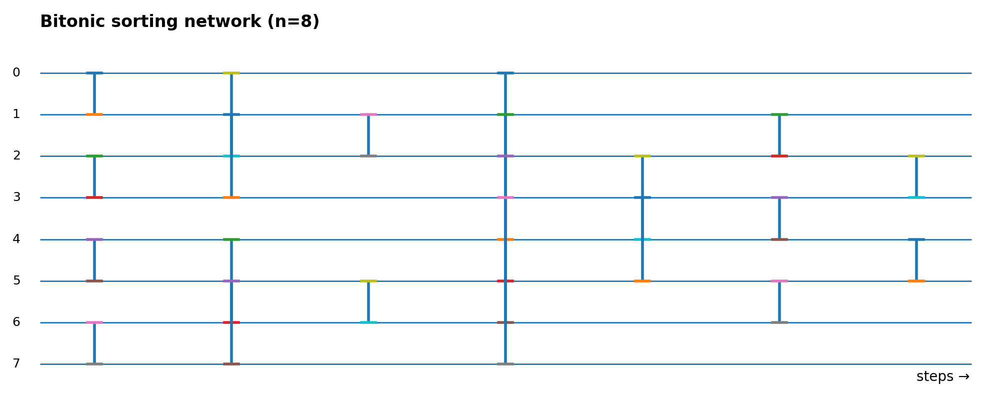
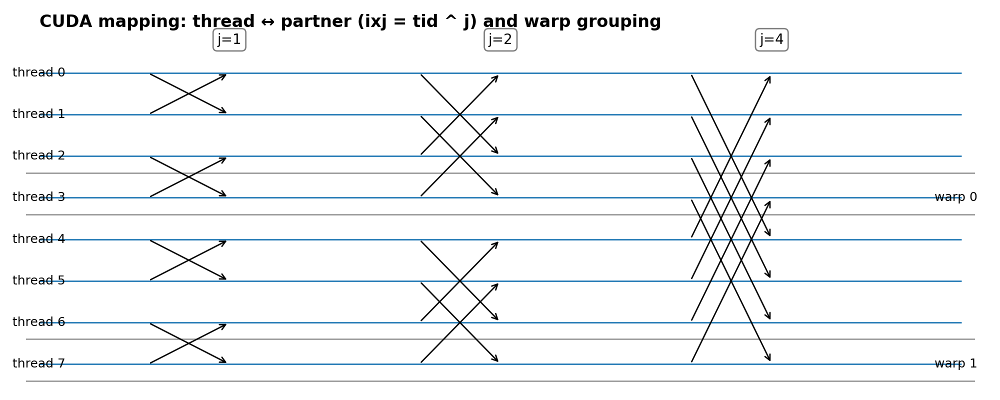

# CUDA Bitonic Sorting

## Overview

This project investigates progressive optimization techniques for **Bitonic Sorting** on NVIDIA GPUs using CUDA.  

---

## Repository layout

```
.
├── bitontic_sorting.cu                   # single-block bitonic (N < 1024)
├── bitontic_sorting_block.cu             # tiled naive version (baseline)
├── bitontic_sorting_block_v1.cu          # shared-memory optimized
├── bitontic_sorting_block_v2.cu          # padding attempt to reduce bank conflicts
├── bitontic_sorting_block_v3.cu          # warp-level primitives (shuffle) optimization
├── docs/
│   ├── bitonic_network.png               # bitonic network diagram
│   └── cuda_mapping.png                  # CUDA thread mapping diagram
└── README.md
```

---

## Background: Bitonic Sorting

Bitonic sort is a sorting-network algorithm consisting of fixed compare-and-swap stages that transform input sequences into sorted order.  
Its regular structure and deterministic communication pattern make it attractive for SIMD and GPU architectures.

**Key properties**
- Input size typically assumed to be $begin:math:text$ n \= 2\^k $end:math:text$
- Complexity: $begin:math:text$ O\(n \\log\^2 n\) $end:math:text$
- Comparison pattern is data-independent (good for GPUs)

### Bitonic sorting network (visual)



*Figure: Bitonic sorting network for 8 elements (phases and steps).*

---

## Mapping Bitonic Sort to CUDA

Each comparator in the network can be performed by a GPU thread. The typical mapping strategy:

- Partition the input into tiles (each tile handled by a CUDA block)
- Load a tile into **shared memory**
- Perform tile-local bitonic sorting entirely in shared memory
- Perform global merge stages by launching kernels for each `(k, j)` stage, or by performing tile-pair merges in shared memory

The partner index in the typical implementation uses bitwise XOR:

```
ixj = tid ^ j
```

This corresponds directly to the comparator connections in the sorting network.

### CUDA mapping illustration



*Figure: Mapping threads to comparators and typical partner computation `ixj = tid ^ j`. Warps are shown grouping contiguous thread lanes.*

---

## Implementations

### 1) `bitontic_sorting.cu` — Single-block bitonic (baseline)
- Implements bitonic sorting entirely within a single CUDA thread block using shared memory.
- Limitation: Supports only `N < 1024` (or `N <= maxThreadsPerBlock`) due to block size and shared memory constraints.
- Purpose: A minimal working reference and correctness baseline.

### 2) `bitontic_sorting_block.cu` — Tiled naive
- Splits the array into tiles and sorts each tile via a per-block kernel.
- Performs global merge stages via host-driven kernel launches (each `(k,j)` launched as a kernel).
- Baseline to measure impact of further optimizations.

### 3) `bitontic_sorting_block_v1.cu` — Shared-memory optimized
- Loads each tile into shared memory and performs the bitonic network there.
- Reduces global memory traffic and improves latency compared to naive tiling.

### 4) `bitontic_sorting_block_v2.cu` — Padding for bank-conflict mitigation
- Adds padding within shared memory layout to try reducing bank conflicts.
- Example padding strategy:
  ```cpp
  padded_idx = i + (i >> 5); // add 1 slot per warp (warpSize=32)
  ```
- Intended to reduce serialization at shared-bank level when threads access `ixj = tid ^ j`.

### 5) `bitontic_sorting_block_v3.cu` — Warp-level shuffle optimization
- For `j < warpSize` (intra-warp partners), use `__shfl_xor_sync` to exchange values via registers.
- For `j >= warpSize`, fall back to shared-memory operations.
- This avoids shared-bank conflicts and synchronization costs for many stages.

---

## Experimental Setup

- Input size: `N = 2^25`
- GPU: RTX3090
- Timing: kernel-level timings averaged over multiple runs; ensure warms-up and consistent CUDA device settings.

---

## Results

| Version | Optimisation | Latency (ms) |
|--------:|-------------:|-------------:|
| naive   | -            | 4.992576    |
| v1      | shared       | 4.490467    |
| v2      | padding      | 4.853584    |
| v3      | warp-shuffle | 2.872055    |

### Observations
- Shared memory optimization (v1) provides moderate improvement by reducing global memory accesses.
- Padding (v2) aimed to reduce bank conflicts but resulted in slightly worse performance in this experiment.
- Warp-level shuffle (v3) yields the largest performance gain, removing shared memory access for intra-warp exchanges and lowering synchronization overhead.

---

## Analysis: Why v2 (padding) performed worse

Although padding reduces certain shared-memory bank conflicts, several practical factors can make padding slower overall:

1. **Extra index arithmetic**  
   Padding requires additional index computations (e.g., `pidx = i + (i >> 5)`), which increases instruction count and may add integer arithmetic stalls.

2. **Increased shared-memory footprint**  
   Padding inflates shared memory usage per block, potentially reducing occupancy (fewer concurrent blocks per SM), which can decrease overall throughput.

3. **Bank conflicts may not have been the dominant cost**  
   If the kernel was limited by occupancy, compute, or other memory-level bottlenecks, removing bank conflicts yields little benefit.

4. **Changed memory/coalescing behavior**  
   Padding alters access patterns, possibly reducing L1/L2 cache effectiveness.

**Conclusion:** Padding is a useful tool, but must be used judiciously—often combined with other strategies (warp-shuffle, smaller tiles) after profiling.

---

## Profiling and Debugging Tips

- Use **Nsight Compute (ncu)** to inspect:
  - `achieved_occupancy`
  - `l1tex__t_mem_bank_conflict_pipe_lsu.sum`
  - `dram__bytes.read` / `dram__bytes.write`
  - `sm__warp_issue_stalled_long_metric`
- If bank conflicts are observed, try:
  - small padding increments (per-warp, or per-half-warp)
  - `__shfl_xor_sync` for intra-warp stages
  - reducing tile size to increase occupancy

---

## How to build and run

Compile with `nvcc`:

```bash
nvcc -O3 bitontic_sorting_block_v3.cu -o bitonic_v3
./bitonic_v3
```

Replace `v3` with `v2`, `v1`, or the naive version to test other variants.

---

## Future Work

- Implement tile-pair shared merges to reduce global-stage launches.
- Explore `cudaLaunchCooperativeKernel` + cooperative groups for grid-level synchronization.
- Compare with highly-optimized libraries like **Thrust** or **CUB**.
- Do a deeper micro-architectural profiling per kernel stage and per `j` value.
